# Chiya-chan

これはVOICEROIDを用いたDiscord用の読み上げBotです 
※本スクリプトは個人利用レベルのものであり、第三者による利用を深く想定していません。予めご了承ください

## 機能
* 指定したテキストチャンネルにメッセージが書きこまれると、メッセージの内容をVC読み上げます
    * URLやメディアファイルは区別されて読み上げます 
* chiya-chanが参加しているVCに参加、退出したユーザ名を読み上げます
* VCにchiya-chanだけが残ると、自動的にVCから切断します

## セットアップと起動
※python、Discord.py、VOICEROIDの導入などは割愛

1. 当リポジトリの内容物を全てをDLし、同じ階層にまとめる
1. `config.ini`にDiscoed botトークンと読み上げ対象のテキストチャンネルのIDをセットする
1. [FFmpeg](https://ffmpeg.org/)をbot本体と同じ階層に配置する
1. [voiceroid_daemon](https://github.com/Nkyoku/voiceroid_daemon/tree/v2.0)を開始する 
1. `chiya-chan.py`を叩く

## サーバへの招待と使い方

1. 機能を利用したいサーバへbotを招待します
    * discord developer portalでOAuth2 URL Generatorを使用し招待します 
    このとき、**スコープは「bot」を指定してください**
1. `join`コマンドを使用して、VCにchiya-chanを接続します
1. 設定したテキストチャンネルにメッセージが書きこまれると読み上げを行います

## コマンド
* `join` コマンドを発行したユーザが参加しているVCにchiya-chanを接続します
* `help` ヘルプを表示します
* `reset` chiya-chanを再起動します
* `set [channelID]` 読み上げを行うチャンネルを再設定します

## 構成

## 使用している主なライブラリなど

Discord.py 
https://discordpy.readthedocs.io/ja/latest/

voiceroid_daemon 
https://github.com/Nkyoku/voiceroid_daemon/tree/v2.0

FFmpeg 
https://ffmpeg.org/

VOICEROID 
https://www.ah-soft.com/voiceroid/

（※スクリプト作成の参考元） 
[DiscordのテキストをVOICEROIDが読み上げてくれるBOTを作ってみた](https://www.nohara.dev/entry/2020/07/10/060000)